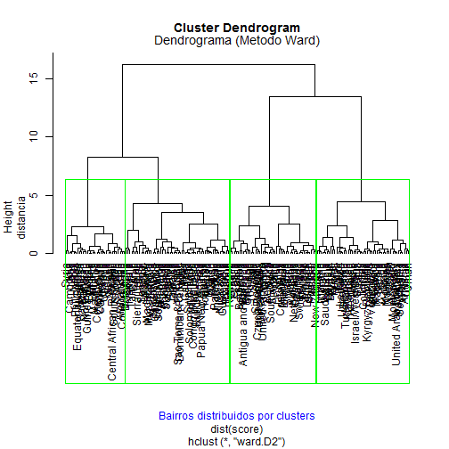

Developing Data Products Presentation
========================================================
author: Eduardo Gaspar
date: 27/12/2015

First Slide
========================================================

For more details on authoring R presentations click the
**Help** button on the toolbar.

- Bullet 1
- Bullet 2
- Bullet 3

2 Slide With Code
========================================================


```r
summary(cars)
```

```
     speed           dist       
 Min.   : 4.0   Min.   :  2.00  
 1st Qu.:12.0   1st Qu.: 26.00  
 Median :15.0   Median : 36.00  
 Mean   :15.4   Mean   : 42.98  
 3rd Qu.:19.0   3rd Qu.: 56.00  
 Max.   :25.0   Max.   :120.00  
```

3 Slide With Plot
========================================================

 

4 Slide With Plot
========================================================

 

5 Slide With Plot
========================================================

 
