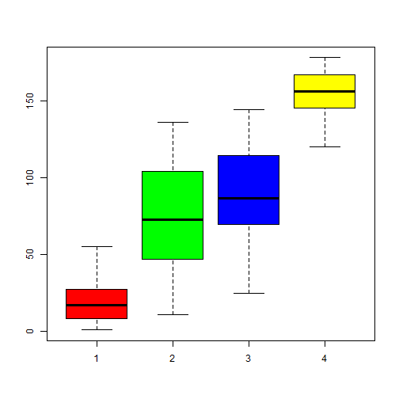

Developing Data Products Presentation
========================================================
author: Eduardo Gaspar
date: Sun Dec 27 14:40:14 2015

Online Analysis Tool
========================================================

This ShinyApp is a prototype to be used in a undergrad class helping students do their class exercises.  
The idea is that the students can load their datasets and run online tests and this will be a long term project, right now it's only a glimpse.  

It was implemented two things:

- a factorial analysis with fixed parameters
- a hierarchical cluster also with fixed parameters.

Dendrogram Code
===


```r
dat <- factanal( data1(),
             factors = input$factors,
             method = "mle",
             scores = input$scores )

score <- dat$scores

dendrogram = hclust( dist( score ),
                 method = "ward.D2" )
classe <<- cutree( dendrogram,
              k = input$ncluster )

rect.hclust( dendrogram,
         k = input$ncluster,
         border = "green" )
```

Data Summary
===
<small>

```r
summary( data )
```

```
      NA.               Fragile.States.Index.2015     Total       
 Min.   :  1.00   Afghanistan        :  1         Min.   : 17.80  
 1st Qu.: 45.00   Albania            :  1         1st Qu.: 53.00  
 Median : 89.50   Algeria            :  1         Median : 74.55  
 Mean   : 89.42   Angola             :  1         Mean   : 70.20  
 3rd Qu.:133.50   Antigua and Barbuda:  1         3rd Qu.: 86.90  
 Max.   :178.00   (Other)            :173         Max.   :114.50  
 NA's   :1        NA's               :  1         NA's   :1       
 Demographic.Pressures Refugees.and.IDPs Group.Grievance   Human.Flight  
 Min.   :1.500         Min.   : 1.100    Min.   : 1.300   Min.   :1.000  
 1st Qu.:4.100         1st Qu.: 2.925    1st Qu.: 4.500   1st Qu.:3.850  
 Median :5.900         Median : 4.700    Median : 6.300   Median :5.800  
 Mean   :5.952         Mean   : 5.045    Mean   : 6.180   Mean   :5.525  
 3rd Qu.:8.000         3rd Qu.: 7.250    3rd Qu.: 7.775   3rd Qu.:7.175  
 Max.   :9.800         Max.   :10.000    Max.   :10.000   Max.   :9.300  
 NA's   :1             NA's   :1         NA's   :1        NA's   :1      
 Uneven.Development Poverty.and.Economic.Decline Legitimacy.of.the.State
 Min.   :1.000      Min.   :1.500                Min.   : 0.400         
 1st Qu.:4.825      1st Qu.:4.500                1st Qu.: 4.725         
 Median :6.400      Median :5.900                Median : 6.650         
 Mean   :6.122      Mean   :5.790                Mean   : 6.184         
 3rd Qu.:7.675      3rd Qu.:7.075                3rd Qu.: 8.100         
 Max.   :9.700      Max.   :9.300                Max.   :10.000         
 NA's   :1          NA's   :1                    NA's   :1              
 Public.Services   Human.Rights    Security.Apparatus Factionalized.Elites
 Min.   : 1.200   Min.   : 0.900   Min.   : 1.000     Min.   : 1.000      
 1st Qu.: 3.725   1st Qu.: 3.900   1st Qu.: 4.000     1st Qu.: 4.425      
 Median : 5.750   Median : 6.150   Median : 6.000     Median : 7.000      
 Mean   : 5.661   Mean   : 5.802   Mean   : 5.754     Mean   : 6.365      
 3rd Qu.: 7.800   3rd Qu.: 7.700   3rd Qu.: 7.400     3rd Qu.: 8.175      
 Max.   :10.000   Max.   :10.000   Max.   :10.000     Max.   :10.000      
 NA's   :1        NA's   :1        NA's   :1          NA's   :1           
 External.Intervention
 Min.   : 1.000       
 1st Qu.: 4.100       
 Median : 6.200       
 Mean   : 5.824       
 3rd Qu.: 7.600       
 Max.   :10.000       
 NA's   :1            
```
</small>

Dendrogram Plot with 4 Clusters
===

 

Boxplot with 4 Clusters
===

 
